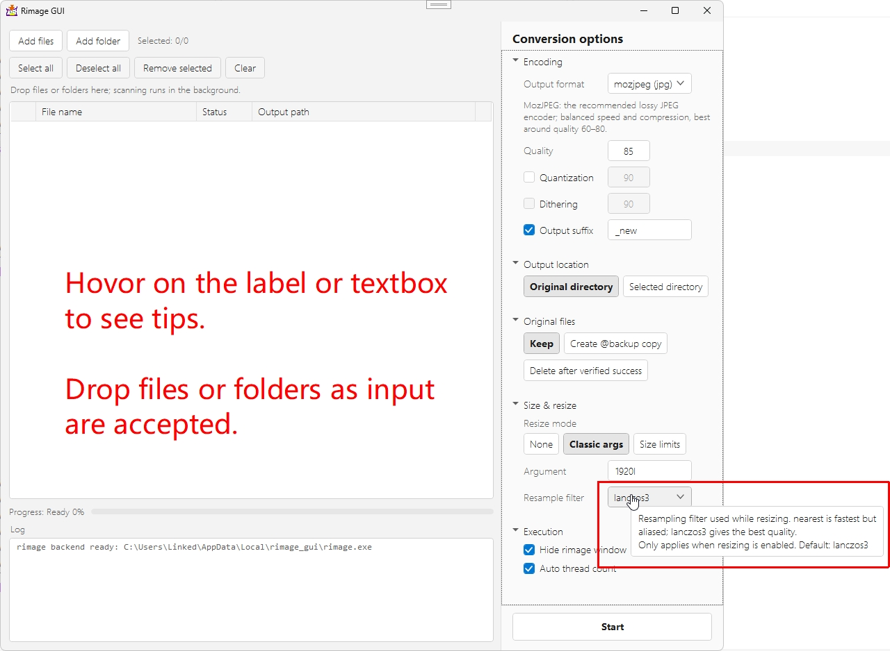

# rimage_gui (WPF)

[中文](README_zh-cn.md) / **English**

A Windows GUI for the [rimage](https://github.com/SalOne22/rimage) image compression command line, built with WPF on .NET Framework 4.8.

## UI



## Image compression effect

You can click to view the original images, which are all provided as-is.


| Before                            | After                        |
| --------------------------------- | ---------------------------- |
|  |  |

As shown in the above images, even the default quality option of **85** only slightly reduces the clarity of the image. If you are looking for "almost invisible loss of clarity", try quality options above 90.

> **Warning**
> If the quality parameters are set too high, the image size may increase instead of decrease!

## Features

- Single-window layout: file list on the left, conversion settings on the right.
- Add files or drop files/folders anywhere on the list; folders are scanned recursively in the background and unsupported extensions are filtered out.
- 7 practical rimage encoders — mozjpeg (jpg), jpeg (jpg), oxipng (png), png (png), webp (webp), avif (avif) and jpeg_xl (jxl) — each labelled with the extension it produces. Formats without a quality parameter (the lossless codecs) disable and clear the quality field automatically.
  - Support svg as input format.
  - Niche intermediate formats (qoi, ppm, farbfeld) are intentionally not offered.
- Quality 100 (with no quantization set) on formats that have a lossless mode switches to the backend's `--lossless` flag automatically (WebP).
- Output to the original directory or a chosen directory (optionally preserving the folder structure), suffix support, `@backup` originals, or delete originals after the output is verified.
- Resize by classic arguments (`@1.5`, `150%`, `1920x1080`, `720w`…) or by a longest/shortest-edge bound, with the full rimage filter list.
- Live progress, per-file status and a log with the exact command line, success/failure diagnostics and a final succeeded/failed/skipped summary.
- Cancellable runs; the backend is embedded per-architecture and verified by hash and `--version` before first use.
- Follows the Windows light/dark theme; Chinese/English UI strings follow the system language.

### Support list

| Format   | Input | Output | Special Notes                               |
| -------- | ----- | ------ | ------------------------------------------- |
| avif     | ✓     | ✓      | Static Only                                 |
| bmp      | ✓     | ✕      |                                             |
| hdr      | ✓     | ✕      |                                             |
| jpg/jpeg | ✓     | ✓      | Use Mozjpeg for more features               |
| jxl      | ✓     | ✓      | Static Only, Lossless Only                  |
| png      | ✓     | ✓      | Lossless Only, Use oxipng for more features |
| psd      | ✓     | ✕      |                                             |
| tif/tiff | ✓     | ✕      |                                             |
| webp     | ✓     | ✓      | Static Only                                 |
| svg      | ✓     | ✓      |                                             |

## Build

Requires the .NET Framework 4.8 Developer Pack (and .NET SDK 6+ for `dotnet build`).

```sh
# development build (reads the backend from res/)
dotnet build wpf/RimageGui/RimageGui.sln

# release build with the rimage backend embedded (pick x64 or x86)
dotnet build wpf/RimageGui/RimageGui.csproj -c Release -p:Platform=x64
```

The release build embeds `res/rimage_<arch>.exe`; at runtime it is unpacked to `%LocalAppData%\Mikachu2333\RimageGUI\cache\<version>\<arch>\` after a SHA-256 integrity check.

## Backend compatibility

This GUI targets **rimage** (the binaries shipped in `res/`). The rimage CLI surface changes between releases, so the GUI refuses to run against any other version.

## License

MIT - see [LICENSE](LICENSE).

Third-party notices: [THIRD_PARTY_NOTICES.txt](THIRD_PARTY_NOTICES.txt).
