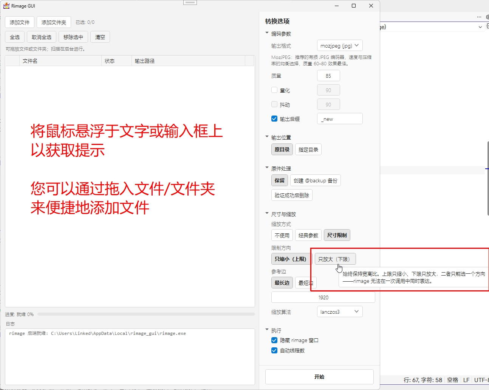
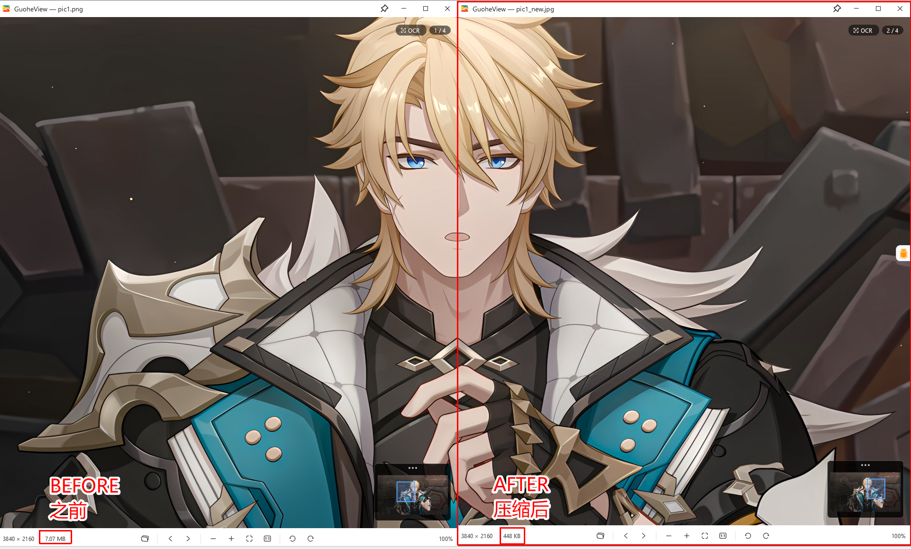

# rimage_gui (WPF)

**中文** / [English](README.md)

本软件是 [rimage](https://github.com/SalOne22/rimage) 的图形化界面（使用 WPF 制作，需要 .NET 4.8 才能运行（Win10/11自带）），rimage 是一个图像压缩软件，您可以通过命令行操作它压缩您的图片。


## UI 界面



## 压缩效果

您可以点击以查看原图，这些图片都以原样提供（As is）。



| Before                            | After                        |
| --------------------------------- | ---------------------------- |
|  |  |

正如上面的图片所示，即便是默认的 **85** 质量选项也仅仅是极其轻微地降低了图片的清晰度。如果您追求“几乎不可见的清晰度损失”，请尝试 90 以上的质量选项。

> **警告**
> 如果设置的质量参数过高，图片体积可能不减反增！

## 功能

- 自释放/更新程序，无需手动下载依赖
- 通过拖拽文件/文件夹即可便捷地添加文件，不支持的文件将被自动过滤
- 当前支持：
  - **输入**：jpg、jpeg、png、webp（不支持动图）、avif（不支持动图）、jxl（不支持动图）、svg
  - **输出**：jpg（moz算法/一般算法）、png（oxipng算法/一般算法）、webp（可无损）、avif（仅无损）、jxl
- 选择输出目录，您可以选择输出目录、文件后缀等选项
- 可以调整文件的大小（支持链式参数，例如先调到 `150%`，再统一拉伸（压缩）到 720 宽度 `720w`）
- 可以选择完成后删除原件或将原件重命名为 `@backup` 作为备份（其实就是用了后缀的功能）
- 支持自动切换中英双语
- 支持自动切换颜色模式（亮色/暗色）

### 支持列表

| 格式支持 | 输入 | 输出 | 特殊事项                                   |
| -------- | ---- | ---- | ------------------------------------------ |
| avif     | ✓    | ✓    | 仅支持静态图                               |
| bmp      | ✓    | ✕    |                                            |
| hdr      | ✓    | ✕    |                                            |
| jpg/jpeg | ✓    | ✓    | 在使用 mozjpeg 时可使用更多特性            |
| jxl      | ✓    | ✓    | 仅支持无损输出，仅支持静态图               |
| png      | ✓    | ✓    | 仅支持无损输出，使用 oxipng 以使用更多特性 |
| psd      | ✓    | ✕    |                                            |
| tif/tiff | ✓    | ✕    |                                            |
| webp     | ✓    | ✓    | 仅支持静态图                               |
| svg      | ✓    | ✓    |                                            |

## 构建

Requires the .NET Framework 4.8 Developer Pack (and .NET SDK 6+ for `dotnet build`).

```sh
# development build (reads the backend from res/)
dotnet build wpf/RimageGui/RimageGui.sln

# release build with the rimage backend embedded (pick x64 or x86)
dotnet build wpf/RimageGui/RimageGui.csproj -c Release -p:Platform=x64
```

The release build embeds `res/rimage_<arch>.exe`; at runtime it is unpacked to `%LocalAppData%\Mikachu2333\RimageGUI\cache\<version>\<arch>\` after a SHA-256 integrity check.

## Backend compatibility

This GUI targets **rimage** (the binaries shipped in `res/`). The rimage CLI surface changes between releases, so the GUI refuses to run against any other version.

## License

MIT - see [LICENSE](LICENSE).

Third-party notices: [THIRD_PARTY_NOTICES.txt](THIRD_PARTY_NOTICES.txt).
